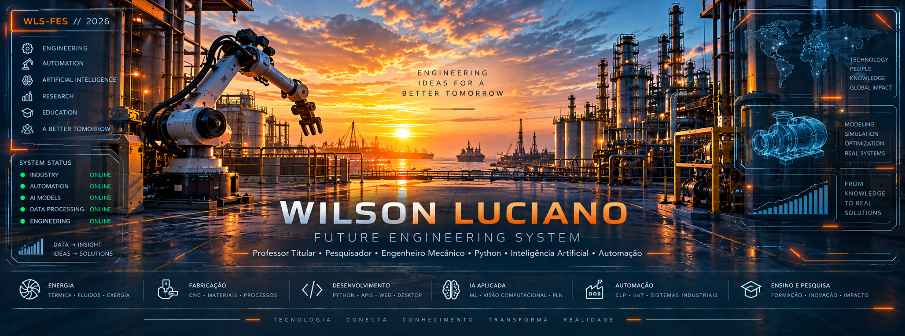

<picture>
  <source media="(prefers-color-scheme: dark)" srcset="assets/future-engineering-system-dark.png">
  <source media="(prefers-color-scheme: light)" srcset="assets/future-engineering-system-light.png">
  
</picture>

# Olá, eu sou Wilson Luciano 👋🏻

### Professor Titular e Pesquisador em Engenharia Mecânica \| Python, Inteligência Artificial e Automação

Sou **Professor Titular e pesquisador da Universidade Federal de Sergipe
(UFS)**, engenheiro mecânico e técnico em eletrônica, com mestrado e
doutorado em Engenharia Mecânica pela **Universidade Federal da Paraíba
(UFPB)**.

Minha trajetória acadêmica e profissional integra **engenharia,
pesquisa, educação e tecnologia**. Atuo na formação de engenheiros, na
pesquisa em engenharia térmica e energia e no desenvolvimento de
soluções computacionais aplicadas ao ensino, à automação e à resolução
de problemas de engenharia.

Atualmente, concentro parte do meu trabalho no uso de **Python,
Inteligência Artificial, Aprendizado de Máquina, APIs e desenvolvimento
de aplicações**, aproximando os fundamentos da Engenharia Mecânica das
tecnologias digitais.

Também sou presidente da [**ABEMEC-SE**](https://abemec-se.org.br/),
contribuindo para a valorização da engenharia e para a aproximação entre
universidade, profissionais, empresas e sociedade.

> 🎯 **PROPÓSITO \|** Aproximar a Engenharia Mecânica das tecnologias
> digitais e transformar conhecimento técnico em soluções úteis,
> didáticas e acessíveis.

## 👨‍🏫 01 \| ENGINEER_IDENTITY

### 🧭 Perfil Profissional

-   🎓 **Academia \|** Universidade Federal de Sergipe \| UFS
-   📚 **Formação \|** Graduação, Mestrado e Doutorado em Engenharia
    Mecânica \| UFPB
-   ⚙️ **Engenharia \|** Térmica \| Energia \| Sistemas Industriais \|
    Fabricação
-   💻 **Tecnologia \|** Python \| IA \| Automação \| Desenvolvimento de
    Software
-   🔬 **Atuação \|** Ensino \| Pesquisa \| Engenharia \| Inovação

## ⚙️ 02 \| ENGINEERING_CORE

Minha formação e experiência abrangem desde os fundamentos da engenharia
térmica e energética até máquinas, processos de fabricação, instalações
e sistemas industriais.

### 🔥 Energia \| Sistemas Térmicos

-   Termodinâmica, Energia e Análise Exergoeconômica
-   Refrigeração, Cogeração e Trigeração
-   Motores de Combustão Interna e Sistemas Térmicos
-   Racionalização e Conversão de Energia
-   Análises Energética, Exergética e Exergoeconômica
-   Gás Natural e Sistemas de Distribuição

### 🏭 Engenharia Mecânica \| Sistemas Industriais

-   Máquinas de Fluxo
-   Instalações e Equipamentos Industriais
-   Automação Industrial \| Sistemas Hidropneumáticos
-   Comando Numérico Computadorizado \| CNC
-   Usinagem Convencional e CNC \| Processos de Fabricação
-   CAD \| Computação Gráfica aplicada à Engenharia
-   Eletrônica Aplicada \| Integração de Sistemas
-   Programação aplicada à Engenharia Mecânica

### 🎓 Engenharia \| Educação

-   Desenvolvimento de Materiais e Ferramentas Educacionais
-   Aplicações Computacionais para Ensino e Engenharia
-   Integração entre Fundamentos de Engenharia e Tecnologias Digitais

## 💻 03 \| TECHNOLOGY_STACK

Utilizo o desenvolvimento de software como instrumento para transformar
conhecimento de engenharia em **aplicações práticas, recursos didáticos
e soluções experimentais**.

### 🧑‍💻 Desenvolvimento de Software

-   **Python** \| Engenharia \| Automação \| Análise de dados \|
    Aplicações educacionais
-   **FastAPI \| Flask** \| APIs \| Serviços \| Aplicações web
-   **Tkinter \| CustomTkinter** \| Interfaces \| Aplicações desktop
-   **HTML \| CSS \| JavaScript** \| Interfaces web
-   Integração com **APIs \| Modelos de IA \| Equipamentos industriais**
-   **Git \| GitHub** \| Testes automatizados \| Organização de projetos
-   Documentação \| Desenvolvimento incremental

### 🧠 Inteligência Artificial

-   Inteligência Artificial aplicada à engenharia e educação
-   Aprendizado de Máquina \| Machine Learning
-   Visão Computacional
-   Processamento de Linguagem Natural \| PLN
-   Integração de modelos de IA em aplicações

## 🤖 04 \| AI_AUTOMATION

### 🔗 Da Engenharia Mecânica à Engenharia Inteligente

A integração entre engenharia, dados, programação, Inteligência
Artificial e automação cria um fluxo contínuo entre o **mundo físico**,
a **informação**, os **algoritmos** e a **ação sobre sistemas reais**.

`MECHANICAL ENGINEERING` \| `ENGINEERING DATA` \| `PYTHON` \|
`ARTIFICIAL INTELLIGENCE` \| `INDUSTRIAL AUTOMATION` \|
`SMART ENGINEERING`

## 🔬 05 \| RESEARCH_EDUCATION

Pesquisa e educação fazem parte do núcleo da minha atuação. Busco
conectar **conhecimento científico, experiência em engenharia e
ferramentas computacionais** para desenvolver novas formas de ensinar,
experimentar e solucionar problemas.

### 🔭 Pesquisa \| Desenvolvimento

-   Engenharia térmica \| Energia
-   Análise energética \| Exergética \| Exergoeconômica
-   Sistemas térmicos \| Sistemas industriais
-   Aplicações computacionais em engenharia
-   Inteligência Artificial \| Aprendizado de Máquina
-   Automação industrial
-   Desenvolvimento de ferramentas educacionais

### 🎓 Formação Acadêmica

-   **Doutorado em Engenharia Mecânica** \| Universidade Federal da
    Paraíba
-   **Mestrado em Engenharia Mecânica** \| Universidade Federal da
    Paraíba
-   **Graduação em Engenharia Mecânica** \| Universidade Federal da
    Paraíba
-   **Técnico em Eletrônica** \| Instituto Federal da Paraíba

## 📊 06 \| GITHUB_METRICS

### 📈 System Activity

**BUILD \| AUTOMATE \| RESEARCH \| INNOVATE**

## 🔗 07 \| SYSTEM_CONNECT

### 🌐 Contato \| Produção Acadêmica

🏛️ **Universidade Federal de Sergipe \| UFS**\
📍 Aracaju \| Sergipe \| Brasil

### ⚙️ ENGINEERING \| 🎓 EDUCATION \| 💻 PROGRAMMING \| 🧠 ARTIFICIAL INTELLIGENCE

**KNOWLEDGE TODAY \| A BETTER TOMORROW**

`WLS-FES // 2026`
